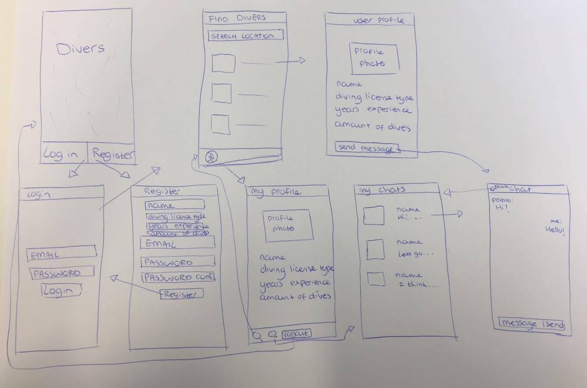

# Divers App
Gemaakt door: Yamie van Wijnbergen

Deze app is bedoeld voor mensen die duiken. De app maakt het mogelijk om duikers met elkaar in contact te brengen. Een gebruiker kan een duiker opzoeken per locatie en vervolgens hem of haar een berichtje sturen via de chatfunctie om op die manier een afspraak te regelen om samen te kunnen duiken.

## Project Proposal

### Het doel: 
De app die ik wil maken is gericht op mensen die duiken. Een belangrijke regel bij het duiken is dat dit altijd samen moet gebeuren; duikers moeten een buddy hebben om samen mee te duiken ter veiligheid. Het doel van deze app is om duikers met elkaar in contact te brengen, zodat ze op die manier een buddy kunnen vinden om mee te duiken. Deze app is een oplossing voor mensen die duiken, die geen andere duikers kennen. Hetzij omdat je bijvoorbeeld de enige in je vriendenkring bent met een duikbrevet, of omdat je op vakantie bent en graag wilt duiken maar niemand kent.

### Features: 
De gebruiker kan zich registreren en vervolgens inloggen. Nadat de gebruiker ingelogd is kan hij/zij een profiel opzetten waarin wordt aangegeven hoeveel jaar ervaring hij heeft, hoeveel duiken hij ongeveer heeft gedaan, welk type duikbrevet hij bezit en de locatie (waar bevindt de duiker zich?). Daarnaast is er ook een zoekfunctie gebaseerd op locatie. De gebruiker krijgt dan een lijst te zien met potentiele duikers die ook binnen een bepaalde straal van die locatie zijn. Er zal ook een chatfunctie zijn zodat gebruikers onderling berichten naar elkaar kunnen sturen om een afspraak te maken om samen te duiken.

### De werking: 
Op het beginscherm zijn de knoppen Login en Register. Deze twee knoppen verwijzen naar aparte viewcontrollers. Als een gebruiker zich registreert wordt hij verwezen naar de login viewcontroller. Als de gegevens zijn ingevoerd dan wordt de gebruiker verwezen naar de "Find Divers" tableviewcontroller. Hier kan de gebruiker andere duikers opzoeken die vervolgens in een tableview tevoorschijn komen. Als de gebruiker op een cell klikt komt hij op het profiel van de gebruiker. Hier heeft de gebruiker de optie om op de knop "send message" te klikken om met diegene in contact te komen. Een andere optie in de "Find Divers" tableviewcontroller is de button met een profiel-icoontje. De gebruiker komt dan uit op zijn eigen profiel met de gegevens die hij/zij bij "Register" heeft ingevuld. Vanuit hier zijn er drie knoppen. De gebruiker kan naar "Find Divers", "My Chats" of hij kan uitloggen. De "My Chats" tableviewcontroller laat alle gesprekken zien die hij met andere gebruikers heeft gehad. Als er op 1 van deze gesprekken wordt geklikt dan opent er een nieuwe viewcontroller met het gesprek. Als de gebruiker ervoor kiest om uit te loggen dan opent het beginscherm weer.

### Externe componenten: 
Om een database te creëren van alle gebruikers zal er gebruik gemaakt worden van Firebase. De cocoapods die gebruikt zullen worden zijn FirebaseAuth voor de authenticatie van de login en FirebaseDatabase om gegevens om te slaan. Daarnaast zal ik de library CoreLocation.framework gebruiken zodat de huidige locatie van de gebruiker opgezocht kan worden. Ik zal de pod JSQMessagesViewController importeren om de layout van een chatfunctie te krijgen.

### Mogelijke problemen: 
Er zijn meerdere valkuilen. Ik denk dat de chatfunctie wel een grote valkuil kan zijn. Hier zijn echter wel meerdere tutorials voor te vinden, dus ik ga dat proberen aan te houden. Daarnaast is het opzoeken van gebruikers gebaseerd op locatie ook een mogelijke valkuil. Ik denk dat ik hier te werk moet gaan met coördinaten en deze van elkaar aftrekken en gebruikers binnen een bepaalde straal dan laten zien in de viewcontroller. 

### Review: 
Er bestaat nog geen soortgelijke duikapp. Er bestaan apps waarmee de gebruiker hun duik kunnen noteren in een logboek, of apps om duik-locaties te vinden. DiveAdvisor heeft de functie dat de gebruiker artikelen kan opzoeken gebaseerd op locatie. Ze hebben een lijst met alle landen die vervolgens refereren naar een nieuw scherm. Dit wil ik niet. Ik wil dat zo’n lijst van landen in de backend is en dat het land herkent wordt zodra deze in de zoekbalk ingetypt wordt. De visualisatie van de Facebook Messenger app wil ik aanhouden als layout voor de chatfunctie; simpel en duidelijk welk bericht van wie is. De extra features van Facebook Messenger zoals bellen, videobellen, foto’s of documenten sturen laat ik buiten beschouwing.

### Minimum viable product: 
De app moet sowieso gebruikers kunnen opzoeken en de optie hebben om diegene een bericht te sturen. Optioneel kan zijn om ook nog reviews toe te voegen hoe het was om met diegene te duiken. Of om groepchats te maken als je met meerdere mensen wilt duiken. Misschien ook nog de optie bij het profiel om te laten zien op welke plekken de gebruiker al allemaal heeft gedoken.

### Sketch

