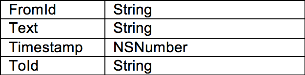

# Final Report
Door: Yamie van Wijnbergen

## App beschrijving
Een belangrijke regel bij het duiken is dat je beter nooit alleen kan duiken. Deze app is hier de oplossing voor. Deze app is een oplossing voor mensen die duiken, die geen andere duikers kennen maar toch niet het risico willen nemen om alleen te duiken. Het doel van DiveBuddy is om duikers met elkaar in contact te brengen, zodat ze op die manier een buddy kunnen vinden om mee te duiken. De gebruiker kan andere duikers vinden op een gewenste locatie en diegene meteen een berichtje sturen om een afspraak te maken.
 

## Technical design
### 1.Classes
#### 1.1 User
Deze klasse bevat alle onderdelen van een gebruiker.

#### 1.2 Annotation
Deze klasse bevat de titel en subtitel voor een Annotation View op een bepaalde locatie. Dit wordt gekoppeld aan de User klasse om de naam en de locatie per gebruiker te krijgen.

#### 1.3 Message
Deze klasse bevat alle onderdelen nodig om een bericht te identificeren van wie het is, naar wie het is verstuurd, op welk tijdstip het verzonden is en het berichtje zelf. Ook hier wordt de klasse gekoppeld aan de User klasse om informatie te krijgen over de gebruiker.

### 2.Controllers
#### 2.1 LoginViewController
In deze viewcontroller kan de gebruiker zich inloggen met hun e-mailadress en bijbehorende paswoord. Dit gaat via de signIn functie van FirebaseAuthenticate. Als de gebruiker al is ingelogd, dan wordt dit onthouden met de "addStateDidChangeListener" functie van FirebaseAuthenticate.

#### 2.2 RegisterViewController
In deze viewcontroller worden een aantal dingen aangehaald. Ten eerste gebruik ik de Core Location framework om de locatie van de gebruiker op te vragen. Daarnaast gebruik ik de UIImagePickerController klasse zodat de gebruikers een foto kunnen kiezen uit hun eigen foto's. Vervolgens gebruik ik FirebaseAuthenticate om een nieuwe gebruiker te registreren aan de hand van hun emailadres en paswoord. Ook moeten de gebruikers nog andere velden invullen om informatie te krijgen over hun duik-profiel (hun naam, hun ervaring, hun certificaat en gemiddeld aantal duiken). Deze values sla ik vervolgens op in FirebaseDatabase.

#### 2.3 DiversMapViewController
Ik gebruik in deze viewcontroller de MapKit framework. Aan de hand van de opgeslagen locaties van de gebruikers worden er pinnetjes op de kaart gezet. Hiervoor gebruik ik de klasse User en de klasse Annotation. De gegevens van een gebruiker in Firebase worden opgeslagen in een dictionary, en deze wordt ingeladen in de klasse User. Deze wordt vervolgens gekoppeld aan de Annotation klasse. Met deze klasse haal ik de gegevens van de gebruiker op en stop deze in de AnnotationView. Met het klikken op een annotation wordt die bepaalde gebruiker opgehaald en komt er een segue naar het profiel van die gebruiker.

#### 2.4 UserProfileViewController
De gegevens van de gebruiker worden opgeslagen in de User klasse zodra de gebruiker op de annotatie klikt. Deze klasse wordt vervolgens gebruikt in deze viewcontroller om de bijbehorende gegevens op te halen en zichtbaar te maken.

#### 2.5 MyProfileViewController
Ik maak in deze viewController de functie getUserDetails() aan. Hiermee haal ik alle gegevens op uit FirebaseDatabase en maak deze zichtbaar op de bijbehorende plekken in de viewcontroller. Ook is er een LogOut functie. Hiervoor gebruik ik een AlertController om te confirmeren dat de gebruiker wilt uitloggen. En via de functie signOut van FirebaseAuthenticate log ik de gebruiker uit.

#### 2.6 EditProfileViewController
Ik gebruik hier weer de functie getUserDetails(). Als de gebruiker dan zijn profiel wilt aanpassen dat staan de huidige gegevens klaar. Op deze manier hoeft de gebruiker niet alle gegevens te veranderen zonder dat het nil returned. Vervolgens maak ik de functie updateProfile(). Hier worden de nieuwe values verwerkt en wordt de functie updateUserinFirebase() aangeroepen om de gegevens op te slaan in Firebase. Zodra de gebruiker op de knop "Edit" klikt wordt de actie saveData() aangeroepen en wordt updateProfile aangeroepen.

#### 2.7 MessageLogViewController
Met de functie observeMessage() maak ik takken aan in Firebase waarin ik kan zien welke berichten waarbij horen. Ik maak namelijk eerst een tak "user-messages" aan voor de huidige gebruiker. En daarbinnen een tak met degene naar wie een bericht wordt gestuurd. Hiervanuit wordt de functie fetchMessageWithMessageId aangeroepen. Onder de tak "Messages" worden alle berichten namelijk opgeslagen met een id en "user-messages" refereert naar het id van de berichten. De functie fetchMessageWithMessageId haalt het juiste bericht bij de Id op. Hier gebruik ik de klasse Message voor.

#### 2.8 MessageViewController
In deze viewcontroller heb ik een aantal functies voor de textfield. Deze functies bij elkaar hebben het doel om de textfield naar boven te schuiven zodat deze niet onder het toetsenbord terecht komt. Met de functie observeMessages() worden alle berichten opgehaald die in die conversatie horen tussen huidige gebruiker en andere gebruiker. Zodra de gebruiker een bericht verstuurd door op de knop "Send" te klikken wordt dit in Firebase opgeslagen onder de tak "Messages" en wordt de referentie meteen opgeslagen in de tak "user-messages"

## Challenges + Changes
Toen ik met het idee kwam wist ik al dat ik het met bepaalde dingen moeilijk zou hebben aangezien ik functies wilde implementeren wat helemaal nieuw voor me zou zijn. Ik vond het moeilijk om een zoekfunctie te maken gebaseerd op locatie. Toen heb ik ervoor gekozen om een Mapview te implementeren in plaats van een Tableview. Ik ben heel blij dat ik deze keuze heb gemaakt omdat dit uiteindelijk veel gebruiksvriendelijker is. De gebruiker heeft nu namelijk een sneller en makkelijker overzicht van waar de duikers zitten, en kan makkelijk naar een bepaald wereldgedeelte gaan om duikers op te zoeken (en bijvoorbeeld vooruitplannen voor een vakantie). 

Ik had ook moeite met de chatfunctie. En dan met name het laden van berichten en gegevens van de tegenstander. Het werkt nu helemaal, alleen gaat het soms nog wat traag door de grootte van de foto's. Ik heb om deze reden ervoor gekozen om de grootte van de foto's meteen te comprimeren zodra de gebruiker deze upload.

Ik heb technisch gezien ervoor gekozen om meerdere klasses aan te maken. Deze keuze heb ik gemaakt omdat ik deze meerdere malen gebruik, en ook klasses aan elkaar koppel. Op deze manier bleef het overzichtelijk.

In plaats van losse knoppen heb ik ook gekozen voor een tabbarcontroller voor een mooiere user interface. Deze keuze heb ik gemaakt omdat ik het er voorheen te onoverzichtelijk eruit vond zien en door de tabbarcontroller ziet de gebruiker duidelijk wat de hoofdschermen zijn en waar hij vanuit daar naartoe kan navigeren.

Als laatst heb ik er ook voor gekozen om een "forgot password" functie te maken voor gebruikersvriendelijkheid.

